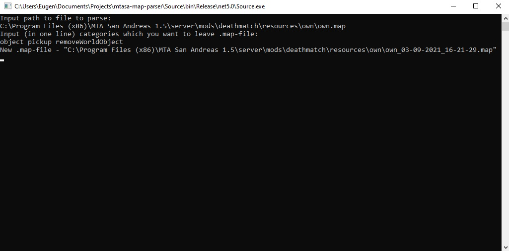

# mtasa-map-parser

Usage:
1. Install file from last release
2. Run it
3. Write absolute .map-file path  
4. Enter name of categories separated by space, here they're:
    * object
    * marker
    * ped
    * pickup
    * vehicle
    * removeWorldObject
5. Enjoy! (:

Example:

